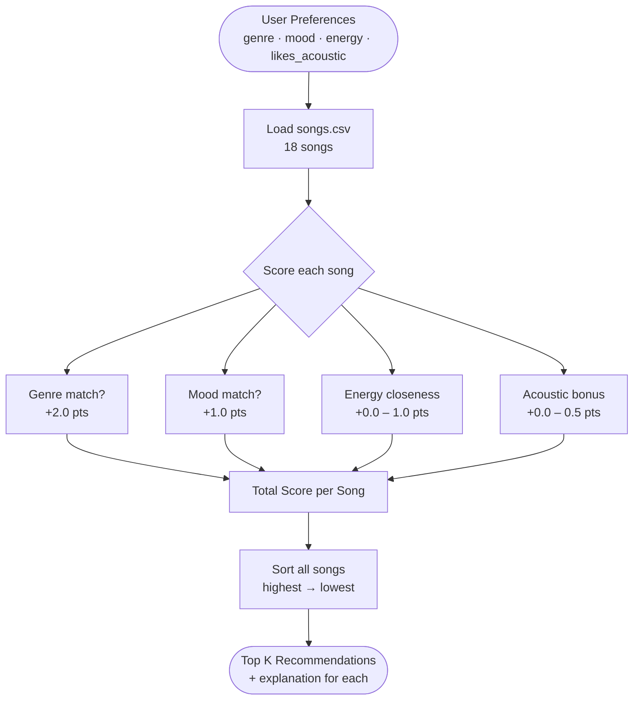

# Music Recommender Simulation

## Project Summary

VibeMatch 1.0 is a small music recommender that scores a 10-song catalog against a user's stated preferences — favorite genre, favorite mood, target energy level, and whether they like acoustic-sounding music. It ranks every song by score and returns the top results along with a plain-language explanation for each recommendation.

---

## How The System Works

### Data Flow



### Algorithm Recipe

**Song features used in scoring:**

| Feature | Type | Description |
|---|---|---|
| `genre` | categorical | Pop, lofi, hip-hop, latin, etc. |
| `mood` | categorical | Happy, chill, intense, romantic, etc. |
| `energy` | float 0–1 | How active or intense the track feels |
| `acousticness` | float 0–1 | How acoustic vs. electronic the sound is |

Dataset also stores `tempo_bpm`, `valence`, and `danceability` — collected but not yet scored.

**User profile fields:**

| Field | Type | Description |
|---|---|---|
| `favorite_genre` | string | The genre they most want to hear |
| `favorite_mood` | string | The emotional feel they are after |
| `target_energy` | float 0–1 | How high or low energy they want |
| `likes_acoustic` | bool | Whether they prefer acoustic-leaning tracks |

**Scoring weights:**

| Condition | Points |
|---|---|
| Song genre == favorite genre | +2.0 |
| Song mood == favorite mood | +1.0 |
| Energy closeness: `1.0 - abs(song.energy - target)` | +0.0 to +1.0 |
| Acousticness bonus (only when `likes_acoustic=True`): `acousticness × 0.5` | +0.0 to +0.5 |

**Max possible score:** 4.5 (genre + mood + perfect energy + full acoustic bonus)

All songs are scored, sorted highest to lowest, and the top `k` are returned (default: 5). Each result includes a plain-language explanation naming which factors contributed.

### Expected Biases

- **Genre over-prioritization** — a genre-matching song that misses on every other feature will still outscore a mood-matching song from a different genre. Users whose genre is rare in the catalog will be especially affected.
- **Energy dominance among non-matches** — when genre and mood both miss, songs are differentiated only by energy closeness. Two very different tracks with similar energy levels will rank the same.
- **Acoustic listeners favored** — `likes_acoustic=True` adds up to 0.5 bonus points, which can push an acoustic track ahead of a closer non-acoustic match. Users who do not like acoustic get no equivalent bonus.
- **Catalog coverage gaps** — genres not in the catalog (classical, metal, country, reggae, k-pop, etc. were only added in Phase 2) will never earn a genre match for users who prefer them.

---

## Getting Started

### Setup

1. Create a virtual environment (optional but recommended):

   ```bash
   python -m venv .venv
   source .venv/bin/activate      # Mac or Linux
   .venv\Scripts\activate         # Windows
   ```

2. Install dependencies:

   ```bash
   pip install -r requirements.txt
   ```

3. Run the app:

   ```bash
   python -m src.main
   ```

### Running Tests

```bash
pytest
```

You can add more tests in `tests/test_recommender.py`.

---

## Experiments You Tried

**Experiment 1 — Genre weight vs. mood weight**
With genre at +2.0 and mood at +1.0, a genre match dominates. A pop/sad song outscores a jazz/happy song for a pop/happy user. Lowering genre weight to +1.0 made the rankings feel less decisive — ties became more common in a 10-song catalog.

**Experiment 2 — Adding the acoustic bonus**
Without the acoustic bonus, a chill/lofi user received the same top results whether or not they preferred acoustic. Adding the `likes_acoustic` flag meaningfully separated acoustic lofi tracks from electronic ones for users who care.

**Experiment 3 — Different user profiles**
- A pop/happy/high-energy user got clean, intuitive results.
- A lofi/chill/acoustic user got excellent matches — the catalog covers that taste well.
- A jazz/relaxed user got one good match then fell off a cliff — the catalog simply lacks enough jazz tracks to fill a top-5 list.

---

## Limitations and Risks

- The catalog has only 10 songs. Users in underrepresented genres (hip-hop, R&B, classical, Latin) will never get a genre match.
- Valence, danceability, and tempo are ignored — the system cannot distinguish a high-energy song that feels joyful from one that feels aggressive.
- Genre is weighted twice as heavily as mood, which is an assumption that may not hold for all users.
- The system treats all users as having a single, stable preference. It cannot model a user who wants variety or whose taste changes by context.

---

## Reflection

Read and complete `model_card.md`:

[**Model Card**](model_card.md)

Building this made clear how much a recommender depends on data coverage before the algorithm even matters. The scoring logic can be sound, but a 10-song catalog with no hip-hop or Latin music will systematically underserve users whose taste lives there — no weight adjustment fixes missing data.

It also made visible how many implicit decisions shape a system that looks simple. Choosing to weight genre at 2x is a claim about human taste. Choosing to ignore valence is a claim that emotional positivity does not matter as much as energy. Real recommenders embed thousands of decisions like these, which is why being able to explain a recommendation — and audit where bias enters — matters so much.

# Screenshots
