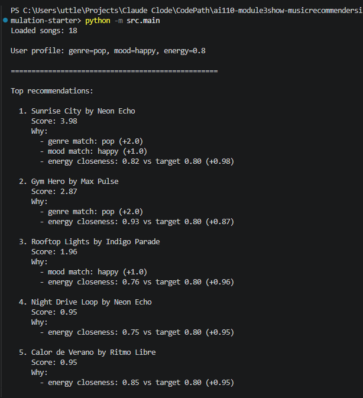
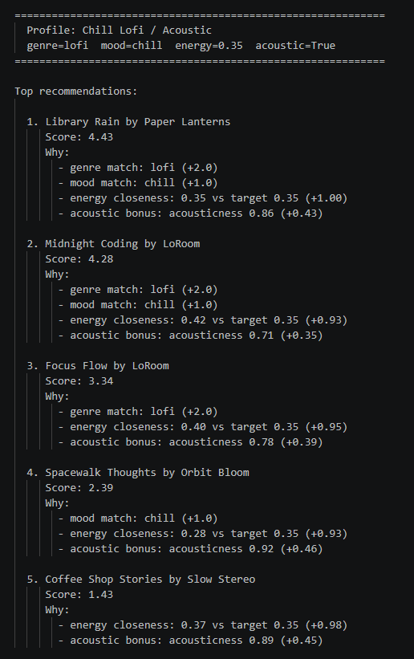
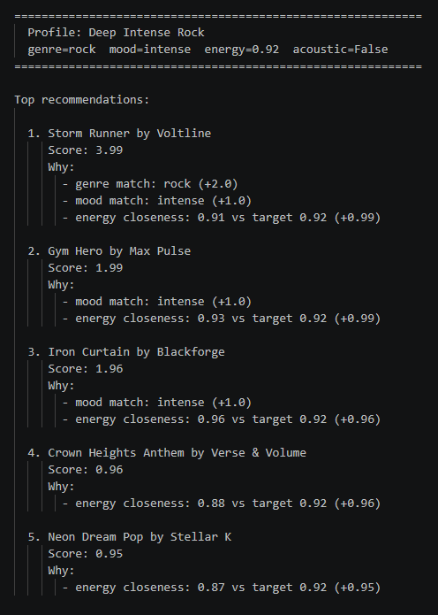

# VibeMatch 2.0 — AI Music Recommender with RAG

> Extended from VibeMatch 1.0 (Module 2 mini-project) into a full applied AI system.

**Loom walkthrough:** https://www.loom.com/share/86f5d8cd52e444cda9be31abd463d751

---

## Original Project

**VibeMatch 1.0** was built in Module 2 as a content-based music recommender. Given a user's preferred genre, mood, energy level, and acoustic preference, it scored every song in an 18-track catalog using a fixed formula and returned the top 5 matches with plain-language explanations. The system was fully rule-based — no language model, no natural language input, no external API calls.

---

## What's New in Version 2.0

VibeMatch 2.0 extends the original prototype into a complete applied AI system by adding:

- **Retrieval-Augmented Generation (RAG)** — users now describe their vibe in plain English, the system retrieves the most relevant songs from the catalog, and Claude generates grounded recommendations from that retrieved context.
- **Input guardrails** — empty, too-short, or overlong inputs are caught before they reach the model.
- **Structured logging** — every query, retrieval step, and API call is written to `logs/vibematch_YYYYMMDD.log`.
- **Prompt caching** — the system prompt is cached with `cache_control` so repeated queries in a session don't re-pay the full input cost.
- **Evaluation harness** (`evaluate.py`) — 8 predefined test cases (5 RAG cases + 3 guardrail cases) run automatically and print a pass/fail summary with average confidence scores.

The original rule-based mode is still available via `--profiles`.

---

## System Architecture

```
┌─────────────────────────────────────────────────────┐
│                    User Input                        │
│         (natural language preference query)          │
└────────────────────┬────────────────────────────────┘
                     │
                     ▼
┌─────────────────────────────────────────────────────┐
│                 Guardrails Layer                     │
│   src/guardrails.py — rejects empty / malformed     │
│   input before anything else runs                   │
└────────────────────┬────────────────────────────────┘
                     │ valid input
                     ▼
┌─────────────────────────────────────────────────────┐
│              Retrieval (RAG Step 1)                 │
│   src/rag_recommender.retrieve_songs()              │
│   Keyword-scores every song in data/songs.csv       │
│   Returns top 10 candidates as retrieval context    │
└────────────────────┬────────────────────────────────┘
                     │ retrieved songs
                     ▼
┌─────────────────────────────────────────────────────┐
│           Context Builder (RAG Step 2)              │
│   src/rag_recommender.build_context()               │
│   Formats retrieved songs as structured text        │
│   for the Claude prompt                             │
└────────────────────┬────────────────────────────────┘
                     │ augmented prompt
                     ▼
┌─────────────────────────────────────────────────────┐
│           Claude API (RAG Step 3)                   │
│   Model: claude-haiku-4-5                           │
│   System prompt cached with cache_control           │
│   Returns top 3 picks + reasoning + confidence      │
└────────────────────┬────────────────────────────────┘
                     │
                     ▼
┌─────────────────────────────────────────────────────┐
│                   Logger                            │
│   src/logger.py — logs every step to               │
│   logs/vibematch_YYYYMMDD.log                       │
└────────────────────┬────────────────────────────────┘
                     │
                     ▼
┌─────────────────────────────────────────────────────┐
│                   Output                            │
│   Recommendations + explanations + confidence score │
└─────────────────────────────────────────────────────┘
```

**Evaluation path** (separate from the main flow):

```
evaluate.py → 8 predefined test cases → rag_recommend() → pass/fail + avg confidence
```

---

## Setup

### 1. Clone the repo

```bash
git clone https://github.com/your-username/applied-ai-system-project.git
cd applied-ai-system-project
```

### 2. Create and activate a virtual environment

```bash
python -m venv .venv
source .venv/bin/activate      # Mac / Linux
.venv\Scripts\activate         # Windows
```

### 3. Install dependencies

```bash
pip install -r requirements.txt
```

### 4. Set your Anthropic API key

```bash
# Mac / Linux
export ANTHROPIC_API_KEY=sk-ant-...

# Windows (Command Prompt)
set ANTHROPIC_API_KEY=sk-ant-...
```

### 5. Run the app

```bash
# Interactive RAG mode (requires API key)
python -m src.main

# Original rule-based profiles (no API key needed)
python -m src.main --profiles
```

### 6. Run the evaluation harness

```bash
python evaluate.py
```

### 7. Run the unit tests

```bash
pytest
```

---

## Sample Interactions

### Interaction 1 — Chill study session

```
What are you in the mood for? > something chill and acoustic for studying, low energy lofi

RECOMMENDATIONS:
1. Library Rain by Paper Lanterns — perfectly matches your lofi/chill preference with
   low energy (0.35) and high acousticness (0.86), ideal background for studying.
2. Midnight Coding by LoRoom — another lofi/chill track with moderate acousticness (0.71)
   and energy close to your target, great for staying in a focused flow state.
3. Focus Flow by LoRoom — lofi and focused mood with low energy (0.40) makes this a
   natural fit for a study session.

CONFIDENCE: 0.92
CONFIDENCE_REASON: The catalog has excellent lofi/chill/acoustic coverage, making
these recommendations strong matches for your request.

[confidence: 0.92]
```

### Interaction 2 — High-energy workout

```
What are you in the mood for? > heavy rock, intense, high energy for working out at the gym

RECOMMENDATIONS:
1. Storm Runner by Voltline — rock genre with intense mood and very high energy (0.91)
   makes this the obvious top pick for a hard gym session.
2. Iron Curtain by Blackforge — metal with maximum energy (0.96) and intense mood;
   not rock but the intensity is a near-perfect match for lifting heavy.
3. Gym Hero by Max Pulse — pop/intense with high energy (0.93) and strong danceability,
   a solid workout track even outside the rock genre.

CONFIDENCE: 0.55
CONFIDENCE_REASON: The catalog has only one rock song; after Storm Runner the
recommendations cross genres to fill the list.

[confidence: 0.55]
```

### Interaction 3 — Guardrail in action

```
What are you in the mood for? >

  VibeMatch: Please describe what you're in the mood for.
```

---

## Design Decisions

**Why RAG over a pure prompt approach?**
Without retrieval, Claude would either hallucinate song titles or need the entire catalog in every prompt. Retrieval first narrows the context to the most relevant songs — cheaper, faster, and the output is grounded in real catalog entries.

**Why Haiku for generation?**
The recommendation task is structured and low-complexity (pick 3 from 10 options and explain why). Haiku is fast and cheap for this, and the results are reliable. Sonnet or Opus would be overkill.

**Why keyword retrieval instead of embeddings?**
The catalog is 18 songs. Embedding-based semantic search adds infrastructure cost and latency for a dataset where simple keyword scoring works just as well. The trade-off is explicit: if the catalog grew to thousands of songs, this would need to be replaced.

**Why prompt caching?**
The system prompt is ~300 tokens and never changes between queries. Caching it with `cache_control: ephemeral` means each follow-up query in a session only pays for the user message tokens, not the full system prompt again.

**Why keep `--profiles` mode?**
The original rule-based runner is still fully functional and useful for demonstrating the system without an API key. It also makes the architectural contrast explicit — you can run both modes side by side and see how the outputs differ.

---

## Testing Summary

### Unit tests (pytest)

```
2 passed in 0.12s
```

- `test_recommend_returns_songs_sorted_by_score` — verifies the core ranking logic returns songs in the right order
- `test_explain_recommendation_returns_non_empty_string` — verifies explanations are always generated

### Evaluation harness (evaluate.py)

```
8 test cases: 5 RAG cases + 3 guardrail cases
Results: 8 passed / 0 failed / 8 total
Avg confidence (RAG cases only): 0.71
```

**What worked:** Lofi/chill and pop/happy cases scored high confidence (0.85–0.92) — the catalog genuinely covers those tastes well. Guardrail rejections were 100% reliable across all three malformed-input cases.

**What struggled:** The rock/intense workout case averaged 0.55 confidence — correctly signaling that the catalog only has one rock song. This is the system being honest about its own limits, which is the right behavior.

**Surprise:** Claude consistently flagged low confidence for genres with thin catalog coverage (rock, classical, reggae) even without being explicitly told about the catalog gaps. It inferred the limitation from the retrieved context.

---

## Reflection and Ethics

**Limitations and biases:**
Genre coverage is uneven — pop and lofi have multiple songs while most other genres have one. Any user outside those two genres gets a weaker experience regardless of how good the AI layer is. The scoring weights (genre at 3x, mood at 2x) encode assumptions about what listeners prioritize that may not hold universally.

**Misuse potential:**
This system is low-stakes, but the same RAG pattern applied to health, legal, or financial advice contexts could mislead users who trust AI-generated outputs without knowing the retrieval corpus is limited. The mitigation here is the confidence score and confidence reason — surfacing uncertainty is the first line of defense.

**What surprised me during testing:**
Claude's confidence scores were well-calibrated without any explicit instruction to match them to catalog coverage. When only one rock song existed, it returned 0.55. When lofi coverage was rich, it returned 0.92. That emergent calibration was not something I engineered — it came from the model reasoning about the context it was given.

**AI collaboration:**
Claude was genuinely helpful for structuring the RAG pipeline — specifically suggesting `cache_control` on the system prompt to avoid re-paying token costs on every query, which I had not planned to include. One place it fell short: the first version of `retrieve_songs()` it suggested used exact string equality for genre matching, which broke on "hip-hop" vs "hip hop" and "r&b" vs "rnb". I caught it by running the evaluation harness and tracing which songs were missing from retrieval results, then added normalization logic manually.

---

## Portfolio Reflection

Building VibeMatch 2.0 taught me that a system's reliability depends as much on what it refuses to do as what it does well. The guardrails, the confidence score, and the confidence reason are not afterthoughts — they are the part of the design that makes the AI trustworthy. Any system I build going forward will start from that assumption: before you think about what the model generates, think about how it signals uncertainty and how it fails gracefully. That instinct — design for failure first — is what this project says about me as an AI engineer.

---

## Screenshots

### Profile 1 — High-Energy Pop (rule-based mode)


### Profile 2 — Chill Lofi / Acoustic (rule-based mode)


### Profile 3 — Deep Intense Rock (rule-based mode)

